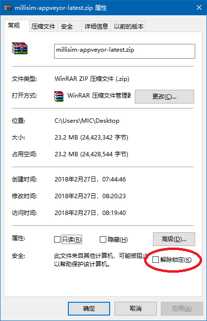

# MilliSim

MilliSim was initially designed as a simulator for [THE iDOLM@STER Million Live! Theater Days](https://millionlive.idolmaster.jp/theaterdays/).
Now it has become a general, plugin-based simulator framework. It can be extended to support other games, such as [Arcaea](https://github.com/hozuki/ArcaeaSim2).
This repository contains the framework itself, and an example of the Theater Days simulator.

Demo videos (Theater Days): 

| Title | Beatmap Author | Branch |
|---|---|---|
| [Death by Glamour](https://www.bilibili.com/video/av15612246/) | [hozuki](https://github.com/hozuki) | v0.2 |
| [dear...](https://www.bilibili.com/video/av16069466/) | MinamiKaze | v0.2 |
| [茜ちゃんメーカー](http://www.nicovideo.jp/watch/sm32977985) | [Sacno](https://twitter.com/Sacno3) | v0.3 |

| Downloads | Status |
|--|--|
| [GitHub Releases](https://github.com/hozuki/MilliSim/releases) |   |
| [AppVeyor](https://ci.appveyor.com/api/projects/hozuki/MilliSim/artifacts/millisim-appveyor-latest.zip) | (latest development build) |

| Build Status | |
|--|--|
| <del>Travis</del> (not maintained) | [](https://travis-ci.org/hozuki/MilliSim) |
| AppVeyor | [](https://ci.appveyor.com/project/hozuki/MilliSim) |

**Stage:** alpha

**Miscellaneous:**

[](https://github.com/hozuki/MilliSim/graphs/contributors)
[](https://github.com/hozuki/MilliSim)
[](LICENSE.txt)

## Usage

**Requirements:**

- Operating System:
  - Windows: Windows 7 SP1 or later
    - [.NET Framework 4.5](https://www.microsoft.com/en-us/download/details.aspx?id=42642)
  - macOS and Linux: macOS 10.8 / Ubuntu 16.04 or later
    - and latest [Wine](https://wiki.winehq.org/Download) (will download `wine-mono` on launch)
- [Visual C++ 2015 Runtime](https://www.microsoft.com/en-us/download/details.aspx?id=53587)
- OpenAL (bundled OpenAL-Soft Win32 build in newer releases)

OpenGL builds (`TheaterDays.OpenGL.exe`) can run on all platforms, but it is problematic.
DirectX builds (`TheaterDays.Direct3D11.exe`) can only run on Windows.

### Note: Video Playback Support

If you want to play videos as the background, you must download FFmpeg binaries (version 3.4.1)
from [here](https://ffmpeg.zeranoe.com/builds/), and place the binaries into `x64` and `x86` directories
correspondingly. Due to license restrictions, MilliSim builds cannot include FFmpeg binaries, so you have
to download them yourself.

[File structure](https://github.com/hozuki/MonoGame.Extended2/tree/master/Sources/MonoGame.Extended.VideoPlayback#usage):

```plain
TheaterDays.*.exe
x64/
  avcodec-57.dll
  avdevice-57.dll
  ...
x86/
  avcodec-57.dll
  avdevice-57.dll
  ...
```

Without FFmpeg, you must either:

1. disable background video (comment out `plugin.component_factory.background_video` in `Contents/plugins.yml`), or
2. leave video file path as empty (`data`-`video` section in `Contents/config/background_video.yml`).

### Note: If MilliSim Cannot Launch

To enable debug mode, use [Command Prompt](https://en.wikipedia.org/wiki/Cmd.exe) to run MilliSim like:

```cmd
MilliSim.Direct3D11.exe --debug
```

When MilliSim encounters problems (e.g. app crash), it will write a debug log in `log-file.txt`. Please open the log and
submit it by [opening an issue](https://github.com/hozuki/MilliSim/issues).

<table style="display: flex; display: -webkit-flex; align-items: center; border: none;">
<tbody>
    <tr style="border: none;">
        <td style="border: none;">
            A common problem of MilliSim not starting may relate to error 0x80131515.
            Since MilliSim uses a plugin architecture, it will scan and load plugin DLLs under its directory.
            That error code means it is not authorized to access those DLLs.
            Please make sure:
            <ol>
                <li>if you run MilliSim in <code>C</code> drive, it must be place somewhere inside your user directory (i.e. <code>C:\Users\YOUR_USER_NAME\SOME_DIR\</code>);</li>
                <li>you must unblock the downloaded ZIP file before you extract the EXEs and DLLs (shown as the picture on the right). (thanks <a href="https://twitter.com/Sacno3">@Sacno3</a>)</li>
            </ol>
        </td>
        <td style="border: none;">
            
        </td>
    </tr>
</tbody>
</table>

## Building

Please read [Building.md](docs/Building.md).

## Developing Plugins

MilliSim is designed to support plugins. Please read the [wiki page](https://github.com/hozuki/MilliSim/wiki/Creating-Plugins) for more information.
(Note: this is mainly about version 0.2 so it may be deprecated. Proceed with caution. Help is appreciated!)

<del>You can find precompiled NuGet packages for plugin development [here](https://www.nuget.org/packages?q=MilliSim).</del> (Suspended; help needed.)

## Other

### Wiki

MilliSim has a [wiki](https://github.com/hozuki/MilliSim/wiki) on GitHub. It is still under construction but you may find some useful information there.

### Naming

The name is an abbreviation of **Milli**on Live **Sim**ulator.

According to English traditions, it should be written and read as *MilliSim*.
Corresponding Japanese version should be *ミリシミュ* (MilliSimu/*mirisimyu*).
Both versions are acceptable.

## License

MIT
